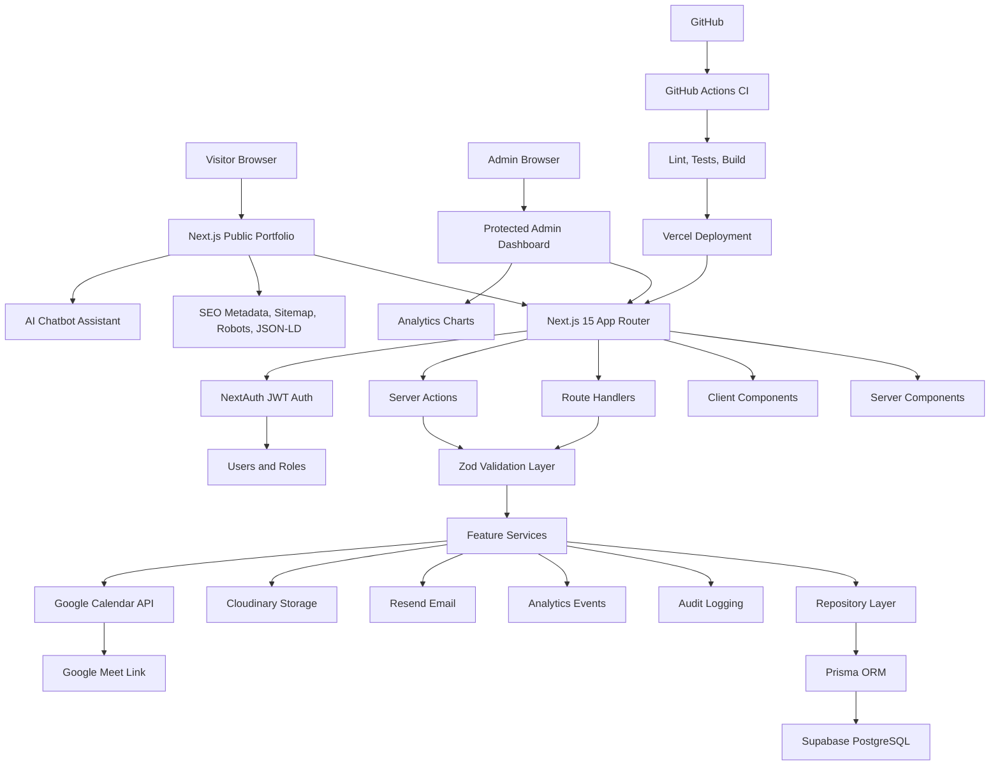

# sudheer Portfolio Platform - Phase 1 Architecture

## 1. High-Level Architecture Diagram



## 2. Complete Folder Structure

```text
sudheer-portfolio-platform/
├── .github/
│   └── workflows/
│       └── ci.yml
├── docs/
│   ├── api/
│   │   └── rest-endpoints.md
│   ├── deployment.md
│   └── phase-1-architecture.md
├── prisma/
│   ├── migrations/
│   ├── seed.ts
│   └── schema.prisma
├── public/
│   ├── images/
│   ├── robots.txt
│   └── sitemap.xml
├── src/
│   ├── app/
│   │   ├── (admin)/
│   │   │   └── admin/
│   │   │       ├── analytics/
│   │   │       ├── audit-logs/
│   │   │       ├── availability/
│   │   │       ├── blogs/
│   │   │       ├── certifications/
│   │   │       ├── contacts/
│   │   │       ├── meetings/
│   │   │       ├── projects/
│   │   │       ├── resume/
│   │   │       ├── settings/
│   │   │       ├── layout.tsx
│   │   │       └── page.tsx
│   │   ├── (auth)/
│   │   │   └── login/
│   │   │       └── page.tsx
│   │   ├── (public)/
│   │   │   ├── about/
│   │   │   ├── blogs/
│   │   │   │   └── [slug]/
│   │   │   ├── book-meeting/
│   │   │   ├── certifications/
│   │   │   ├── contact/
│   │   │   ├── experience/
│   │   │   ├── projects/
│   │   │   │   └── [slug]/
│   │   │   ├── resume/
│   │   │   ├── skills/
│   │   │   ├── layout.tsx
│   │   │   └── page.tsx
│   │   ├── api/
│   │   │   ├── analytics/
│   │   │   ├── auth/
│   │   │   ├── chatbot/
│   │   │   ├── contact/
│   │   │   ├── meetings/
│   │   │   └── upload/
│   │   ├── error.tsx
│   │   ├── globals.css
│   │   ├── layout.tsx
│   │   ├── not-found.tsx
│   │   ├── robots.ts
│   │   └── sitemap.ts
│   ├── components/
│   │   ├── admin/
│   │   ├── analytics/
│   │   ├── forms/
│   │   ├── layout/
│   │   ├── marketing/
│   │   └── ui/
│   ├── config/
│   │   ├── env.ts
│   │   ├── navigation.ts
│   │   └── site.ts
│   ├── features/
│   │   ├── analytics/
│   │   │   ├── analytics.repository.ts
│   │   │   ├── analytics.schemas.ts
│   │   │   ├── analytics.service.ts
│   │   │   └── analytics.types.ts
│   │   ├── audit-logs/
│   │   ├── auth/
│   │   ├── blogs/
│   │   ├── certifications/
│   │   ├── contacts/
│   │   ├── meetings/
│   │   ├── projects/
│   │   └── resume/
│   ├── lib/
│   │   ├── auth/
│   │   ├── calendar/
│   │   ├── cloudinary/
│   │   ├── db/
│   │   ├── email/
│   │   ├── errors/
│   │   ├── logger/
│   │   ├── rate-limit/
│   │   ├── security/
│   │   ├── seo/
│   │   └── utils/
│   ├── server/
│   │   ├── actions/
│   │   ├── middleware/
│   │   └── queries/
│   ├── styles/
│   │   └── theme.css
│   └── types/
│       ├── next-auth.d.ts
│       └── shared.ts
├── tests/
│   ├── api/
│   ├── integration/
│   ├── unit/
│   └── setup.ts
├── .env.example
├── .eslintrc.json
├── .gitignore
├── components.json
├── docker-compose.yml
├── Dockerfile
├── jest.config.ts
├── middleware.ts
├── next.config.ts
├── package.json
├── postcss.config.js
├── tailwind.config.ts
├── tsconfig.json
└── vercel.json
```

## 3. Explanation Of Every Folder

### `.github/workflows`

Stores GitHub Actions pipelines. The initial CI pipeline will install dependencies, run linting, run tests, and build the Next.js application before deployment.

### `docs`

Contains product, architecture, API, and deployment documentation. This keeps long-form project knowledge versioned with the codebase.

### `docs/api`

Contains REST endpoint documentation with method, URL, request schema, response schema, validation, and authentication requirements.

### `prisma`

Contains the Prisma schema, generated migrations, and seed scripts. Prisma is the single source of truth for relational database models and relations.

### `public`

Stores static public assets that can be served directly, including images and SEO files when static versions are needed.

### `src/app`

Contains the Next.js 15 App Router routes, layouts, route handlers, metadata files, error boundaries, and public/admin page entry points.

### `src/app/(public)`

Route group for public website pages. These routes are accessible to visitors and should use Server Components by default for speed and SEO.

### `src/app/(admin)`

Route group for protected admin pages. Access is restricted to authenticated users with the `ADMIN` role.

### `src/app/(auth)`

Route group for authentication pages such as login. Auth screens are separated from public and admin layouts.

### `src/app/api`

Contains Next.js Route Handlers for server-side HTTP endpoints. These endpoints are used for webhooks, uploads, chatbot calls, analytics tracking, contact submission, and meeting workflows.

### `src/components`

Stores reusable React components that are shared across routes and features. Components should remain presentation-focused and avoid direct database access.

### `src/components/ui`

Stores Shadcn UI primitives and locally customized design-system components.

### `src/components/forms`

Stores reusable form components built with React Hook Form and Zod validation.

### `src/components/admin`

Stores admin dashboard shell, tables, filters, navigation, empty states, and admin-specific UI compositions.

### `src/components/analytics`

Stores chart and KPI components for analytics views.

### `src/components/layout`

Stores shared layout elements such as headers, footers, sidebars, navigation, and theme controls.

### `src/components/marketing`

Stores public-facing portfolio sections such as hero, featured projects, testimonial-style proof blocks, timeline sections, and call-to-action sections.

### `src/config`

Stores typed configuration for environment variables, site metadata, navigation, feature flags, and external service settings.

### `src/features`

Contains feature modules. Each feature owns its schemas, types, repository, services, and feature-specific utilities.

### `src/features/*/*.repository.ts`

Repository files encapsulate database access and Prisma calls. This keeps persistence logic out of UI, route handlers, and services.

### `src/features/*/*.service.ts`

Service files contain business rules and orchestration, such as approving meetings, publishing blogs, recording audit logs, and sending emails.

### `src/features/*/*.schemas.ts`

Zod validation schemas for forms, server actions, and route handlers.

### `src/features/*/*.types.ts`

Feature-specific TypeScript types, DTOs, and response shapes.

### `src/lib`

Contains infrastructure adapters and cross-cutting utilities. These modules integrate external services and provide shared technical capabilities.

### `src/lib/auth`

NextAuth configuration, password hashing helpers, JWT callbacks, role checks, and session helpers.

### `src/lib/calendar`

Google Calendar and Google Meet integration adapters.

### `src/lib/cloudinary`

Cloudinary upload, replace, delete, and signed upload helpers.

### `src/lib/db`

Prisma client initialization and database helpers.

### `src/lib/email`

Resend client setup and email template rendering helpers.

### `src/lib/errors`

Centralized application errors, error formatting, and safe API error responses.

### `src/lib/logger`

Structured logging utilities for server-side workflows and audit-friendly diagnostics.

### `src/lib/rate-limit`

Rate limiting helpers for contact forms, meeting requests, login, and chatbot endpoints.

### `src/lib/security`

Security helpers for sanitization, CSRF-sensitive flows, headers, and authorization guards.

### `src/lib/seo`

Metadata builders, canonical URL helpers, Open Graph helpers, Twitter card helpers, and JSON-LD builders.

### `src/lib/utils`

Small framework-neutral utilities such as date formatting, slug normalization, class name merging, and pagination helpers.

### `src/server`

Server-only application layer modules. This folder prevents accidental client-side imports of privileged logic.

### `src/server/actions`

Server Actions for mutations triggered by forms and admin workflows.

### `src/server/middleware`

Reusable middleware helpers for API authentication, role checks, validation, logging, and rate limiting.

### `src/server/queries`

Server-only query functions used by Server Components for public and admin pages.

### `src/styles`

Global theme files and CSS tokens that complement Tailwind configuration.

### `src/types`

Shared global TypeScript declarations, including NextAuth type augmentation.

### `tests`

Contains unit, integration, and API tests. Tests are grouped by behavior and risk level rather than implementation detail.

## 4. Explanation Of Architectural Decisions

### Next.js 15 App Router as the full-stack platform

Next.js App Router supports public pages, admin pages, route handlers, server actions, metadata generation, streaming, and server-first rendering in one deployable application. This reduces operational complexity while still supporting clean boundaries.

### Server Components by default

Public pages and read-heavy admin views should use Server Components wherever possible. This improves performance, reduces client JavaScript, protects server-only secrets, and helps reach strong Lighthouse scores.

### Client Components only for interaction

Client Components should be limited to forms, charts, dialogs, theme toggles, file uploads, rich editors, and interactive scheduler controls.

### Feature-based architecture

Features such as projects, blogs, meetings, contacts, analytics, and resume management own their business logic. This keeps the codebase scalable as the portfolio platform grows.

### Repository pattern

Repositories isolate Prisma queries and database details. Services call repositories instead of importing Prisma directly, which improves testability and keeps business logic independent from persistence details.

### Service layer

Services own workflows and business rules. For example, meeting approval will validate the request, prevent double booking, create a calendar event, generate a Meet link, send email, reserve the slot, and write an audit log.

### Zod validation layer

Every external input path uses Zod schemas, including forms, route handlers, server actions, and environment variables. This provides runtime safety in addition to TypeScript compile-time safety.

### NextAuth with JWT session strategy

JWT sessions are suitable for Vercel deployment and reduce database session overhead. Role data will be included in the token and validated server-side for protected admin access.

### PostgreSQL with Prisma

PostgreSQL provides reliable relational modeling for users, projects, blogs, tags, meetings, analytics, and audit logs. Prisma provides type-safe access and migration management.

### Supabase PostgreSQL for production

Supabase offers managed PostgreSQL with a straightforward Vercel deployment path. The application will still access the database through Prisma, avoiding vendor-specific coupling where possible.

### Cloudinary for file storage

Cloudinary handles image optimization, transformations, and file delivery for project images, certificates, and resume files. This avoids storing files in the application runtime.

### Resend for transactional email

Resend will send contact notifications and meeting workflow emails. Email rendering will be centralized to keep templates consistent and testable.

### Google Calendar integration in an adapter layer

Calendar logic stays inside `src/lib/calendar` and meeting services. This isolates OAuth/API details and makes the core meeting workflow easier to test.

### Security-first admin boundary

Admin routes are protected in middleware and verified again in server-side handlers. Sensitive admin mutations require an authenticated `ADMIN` role and validated input.

### Centralized audit logging

Important admin and authentication events write audit logs through a shared audit service. This gives the system traceability without scattering audit code across UI components.

### SEO as a first-class concern

The public portfolio uses Metadata API, canonical URLs, Open Graph tags, Twitter cards, sitemap generation, robots configuration, and structured JSON-LD.

### CI/CD from the start

The project will include Docker support, GitHub Actions, Vercel configuration, linting, tests, and build checks so production readiness is not deferred until the end.

## 5. Development Roadmap

### Phase 1: System Architecture, Folder Structure, Technology Decisions

Define the high-level system architecture, clean folder structure, major technical decisions, and implementation roadmap.

### Phase 2: Database Design and Prisma Schema

Create the Prisma schema using UUID primary keys, relations, enums, timestamps, indexes, and seed foundations for admin users and starter portfolio data.

### Phase 3: Authentication and Authorization

Implement NextAuth, bcrypt password hashing, JWT sessions, admin login, route protection, role checks, middleware, and authentication tests.

### Phase 4: Public Website

Build the responsive public portfolio pages, SEO metadata, project details, blog details, resume page, contact form, dark mode, animations, and optimized content loading.

### Phase 5: Admin Dashboard

Build the protected dashboard shell and CRUD management areas for projects, blogs, certifications, resume files, contacts, settings, analytics, and audit logs.

### Phase 6: Meeting Scheduler

Implement public booking flow, availability rules, blocked dates, vacation mode, approval mode, auto-approval mode, double-booking prevention, and admin meeting management.

### Phase 7: Google Calendar Integration

Integrate Google Calendar event creation, Google Meet link generation, calendar updates for reschedules, and calendar cancellation behavior for rejected or deleted meetings.

### Phase 8: Email System

Implement Resend email templates for contact submissions, meeting request creation, meeting approval, rejection, and rescheduling.

### Phase 9: Analytics

Track visitors, unique visitors, page views, resume downloads, project views, blog views, traffic sources, geography, meetings, and contact requests. Build admin charts and KPI cards.

### Phase 10: AI Chatbot

Add an optional AI assistant trained on portfolio content that can answer questions about skills, projects, experience, blogs, and meeting scheduling.

### Phase 11: Testing

Add focused unit, integration, and API tests for core services, repositories, server actions, route handlers, auth, validation, and critical UI workflows.

### Phase 12: CI/CD and Deployment

Finalize Docker, Docker Compose, GitHub Actions, Vercel configuration, environment variable template, production deployment guide, and release checklist.

## Phase 1 Status

Phase 1 is complete. Stop here and wait for approval before starting Phase 2.
