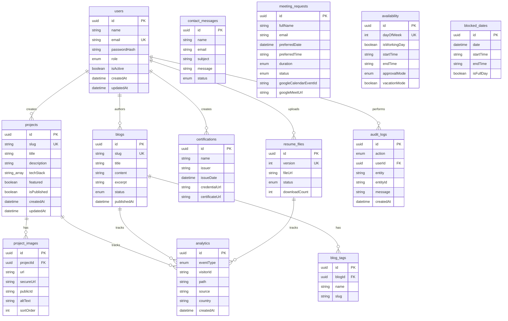

# sudheer Portfolio Platform - Phase 2 Database Design

## Generated Files

```text
D:\sudheer_kumar_portfolio\prisma\schema.prisma
D:\sudheer_kumar_portfolio\docs\phase-2-database-design.md
```

## 1. Database Overview

The platform uses PostgreSQL with Prisma ORM. All primary keys are UUIDs, all core tables include audit-friendly timestamps, and feature data is grouped around the public portfolio, admin CMS, meeting workflow, analytics, and audit logging.

## 2. Entity Relationship Diagram



## 3. Tables And Purpose

### `users`

Stores admin and visitor identities. Admin users can access protected dashboard features. Passwords are stored as bcrypt hashes, never plaintext.

### `projects`

Stores portfolio projects with slug-based routing, SEO metadata, tech stack, publication state, featured state, and view counts.

### `project_images`

Stores Cloudinary-backed project image records. A project can have many ordered images and one or more featured visuals.

### `blogs`

Stores CMS-managed blog posts with markdown content, publishing state, featured image metadata, SEO metadata, and view counts.

### `blog_tags`

Stores tags attached to blog posts. Tags are unique per blog by slug.

### `certifications`

Stores certification data, issuer information, credential links, and uploaded certificate assets.

### `resume_files`

Stores resume versions, Cloudinary file references, active/archive state, and download counts.

### `contact_messages`

Stores public contact form submissions and admin read/archive state.

### `meeting_requests`

Stores meeting booking requests, approval state, requested time, approved calendar time, Google Calendar event IDs, Google Meet URLs, and admin workflow notes.

### `availability`

Stores weekly availability configuration by day of week, working hours, default meeting duration, approval mode, timezone, vacation mode, and custom slot data.

### `blocked_dates`

Stores full-day or partial-day unavailable dates used by the scheduler to prevent bookings.

### `analytics`

Stores page views, unique visitor events, resume downloads, project views, blog views, contact requests, meeting requests, traffic source data, and geography metadata.

### `audit_logs`

Stores security and admin activity records for login, logout, CRUD actions, meeting actions, settings updates, and other important workflows.

## 4. Enums

### `Role`

Defines `ADMIN` and `VISITOR` access levels.

### `BlogStatus`

Defines `DRAFT`, `PUBLISHED`, and `ARCHIVED` blog states.

### `ContactStatus`

Defines `UNREAD`, `READ`, and `ARCHIVED` contact message states.

### `MeetingApprovalMode`

Defines whether meetings require admin approval or are approved automatically.

### `MeetingStatus`

Defines the full meeting lifecycle: pending, approved, rejected, completed, rescheduled, and cancelled.

### `MeetingDuration`

Defines supported scheduler durations: 15, 30, 45, and 60 minutes.

### `ResumeStatus`

Defines active and archived resume file states.

### `AnalyticsEventType`

Defines all analytics events tracked by the platform.

### `AuditAction`

Defines auditable admin and security actions.

## 5. Data Integrity Decisions

### UUID Primary Keys

Every table uses UUID primary keys to avoid predictable IDs and support distributed production environments.

### Slug Uniqueness

Projects and blogs use unique slugs to support stable public routes.

### Resume Versioning

Resume versions are unique. Only one resume should be active at a time, enforced in service logic during Phase 5 because PostgreSQL partial unique indexes are not represented directly in this Prisma schema.

### Meeting Double Booking

The schema includes a unique constraint on `startAt` and `endAt` for approved or scheduled meetings. Service logic in Phase 6 will only assign these fields after a request is approved or auto-approved.

### Cascading Deletes

Project images and blog tags cascade when their parent records are deleted. Analytics and audit records preserve historical context by using nullable relations with `SetNull`.

### JSON Fields

JSON is used only for flexible metadata such as analytics details, audit metadata, and custom availability slots. Core business fields remain strongly typed.

### Indexing

Indexes are added for common query paths: slugs, statuses, dates, roles, event types, visitor IDs, related entity IDs, and dashboard filtering fields.

## 6. Phase 2 Status

Phase 2 is complete. Stop here and wait for approval before starting Phase 3.
